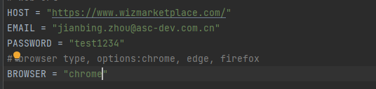
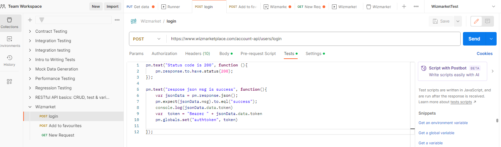
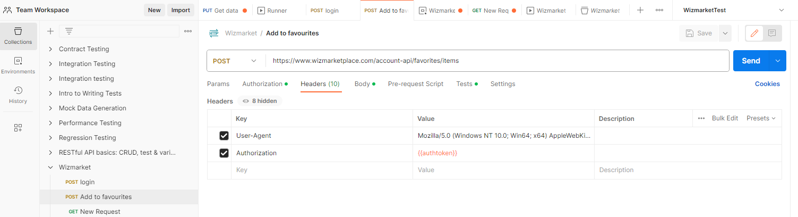

1. This project is created in pycharm
2. All documents are under docs folder
   2.1 the mind map contains the test points for given area
   2.2 in test cases.xlxs, there are some detailed test cases 
   2.3 Issue lists.docs are the bugs found
3. For the webUI test, 
   3.1 it is based on python + selenium + unittest + parameterized
   3.2 config.py you can set access url, login email&password, test browser
    it will automatically download webdriver accordingly 

   
   
   3.3 to run the project, run_suite.py
   3.4 under script folder, the test case just demo the data driven on the UI test. 
      test data is under data/profile.json , it isn't perfect set, 
    just demo it could repeat according to the given data
   3.5. There will be html report generated under report folder
4. For API test, I have just finished those 2 request, haven't include data driven
    In login api, store the security token after sign in
    
    
    Use this toke to do authentication when add to favourites
    
   
  